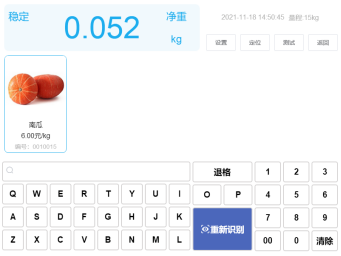
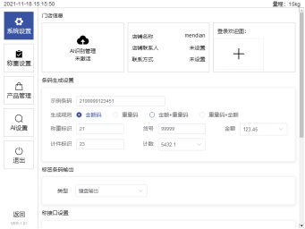
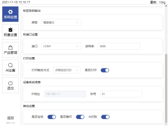
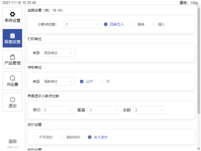
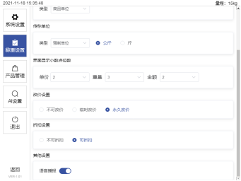
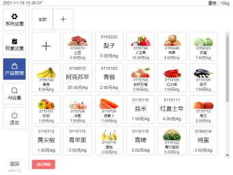
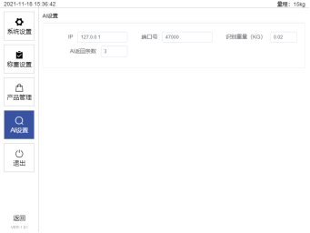

# 3.界面介绍	

## 3.1操作界面介绍

操作界面（主要用于称重、识别以及条码输出），如图2-2所示，主要是由显示区、AI识别区、按钮区以及搜索区组成。

a. 显示区：用于显示重量

b. AI识别区：用于识别并显示商品，识别完成的界面如图3-1所示

c. 按钮区：用于进入设置界面、鼠标定位、测试定位是否成功以及隐藏窗口

d. 搜索区：搜索区可以对商品的助记符、编码以及plu码进行查找，自动匹配出符合条件的商品，以及对商品重新识别。

 

图3-1识别完成的操作界面

 

在识别完成后，点击商品，操作界面会自动隐藏，再次放上商品会自动弹出，或者可以从任务栏再次进入操作界面。

## 3.2设置界面介绍

设置界面包含系统设置、称重设置、产品设置、AI设置，以及返回操作界面的返回按钮。

### 3.2.1系统设置界面

系统设置有条码生成设置、标签条码输出、秤接口设置、打印设置、设备系统信息，以及其他设置，如图3-2a和图3-2b所示。

标签条码输出可以选择“字符串输出”和“键盘输出”，可以匹配不同的收银系统；打印触发方式可以选择“确认重量后打印”和“点击商品打印”，这两个选择不会对窗口进行改变。

 

图3-2a系统设置界面

 

图3-2b系统设置界面续

 

### 3.2.2称重设置界面

称重设置有金额设置，打印单位，传秤单位，界面显示小数点位数，改价设置，折扣设置以及其他设置，如图3-3a和图3-3b所示。

 

图3-3a 称重设置界面

 

图3-3b 称重设置界面

### 3.2.3产品管理界面

产品管理可以添加、清空数据、对单个商品进行修改删除，商品信息也可以通过收银软件向本软件下发商品信息。产品管理界面如图3-4所示，初次使用软件，商品为空。

 

图3-4产品管理界面

### 3.2.4 AI设置界面

AI设置可以设置IP地址，端口号，识别重量以及AI返回条数，AI设置界面如图3-5所示。

 

图3-5 AI设置界面