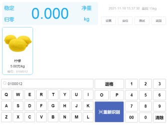
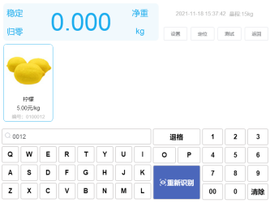
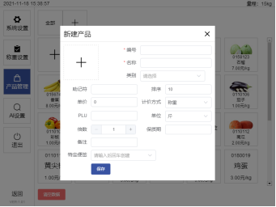
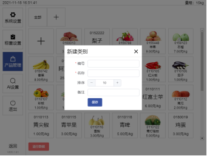
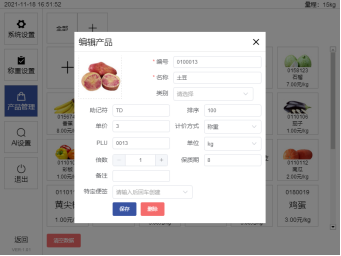

# 4.功能介绍

## 4.1搜索键盘功能

搜索键盘可以对商品的助记符、编码，以及plu码进行查找，自动匹配出符合条件的商品，且搜索键盘支持模糊搜索，因此在输入数据的同时会显示符合当前条件的商品。以下是查询示例：

如图4-1a所示，助记符查找如下，

 

图4-1a 助记符查找

如图4-1b所示，编码查找如下，

 

图4-1b 编码查找

如图4-1c所示，plu码查找如下，

 

图4-1c plu码查找

## 4.2按钮区功能

### 4.2.1定位

定位是在电脑上任取一点，锁定该点的软件中的输入框，在识别完成后对该点下的输入框输出条码。

### 4.2.2测试

测试是对当前定位的点输出一串字符“123456”，用于测试定位是否成功以及该点下的软件是否允许字符串输出。

### 4.2.3返回

返回是用于隐藏当前窗口的，因为操作界面的窗口是始终位于所有窗口的上方，因此在不需要操作界面时，不隐藏该窗口会十分挡视线。

## 4.3产品管理功能

产品管理可以添加、导入、导出以及清空数据，对单个商品进行修改删除，商品信息也可以通过收银软件向本软件下发商品信息。产品管理界面如图4-2所示，初次使用软件，商品为空。

 

图4-2 新建产品界面

新建产品时，编号，名称为必填项，缺少一项都将新建不成功。助记符是根据名称自动生成的，不需要输入。计价方式和单位为下拉菜单栏，默认选择“称重”与“斤”。计价方式的具体选项有“称重，计件”，单位的具体选项有“千克，克，kg，g，公斤，斤，两”。其余信息可以自由设置。

初次使用时，类别为空。新建类别界面如下图4-3所示，编号和名称为必填项缺少一项都将新建不成功。

 

图4-3新建类别界面

商品信息可以通过收银软件向本软件下发商品信息，例如：银豹收银系统，大华上位机等。具体的下发步骤可以去收银软件的官网查看，在本说明书中就不详细介绍了。收银软件下发的商品信息，包含编号、名称、助记符、单价、计价方式、PLU码以及保质期。图集信息如图4-4所示，在下发的信息中不包含类别。

 

图4-4下发的商品信息