# 6.与收银软件对接（传称）

## 6.1云果OS

### 6.1.1传称流程

1. 进入云果OS软件界面（如图6-1所示），

2. 点击更多（如图6-2红框所示），

3. 选择条码秤商品同步（如图6-3所示），

4. 选择大华传输协议，填写秤IPv4地址（查找IP地址方法请看附录A），

5. 点击同步即可。

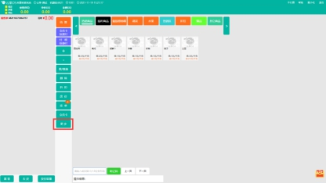 

图6-1云果OS界面

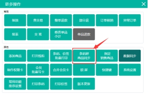 

图6-2更多操作

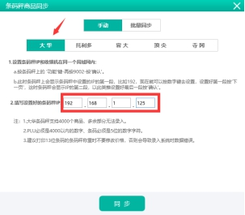 

图6-3条码称商品同步

### 6.1.2注意事项

1. 因为本软件目前仅支持大华传输协议，根据云果OS的大华传输协议规定，传称的商品条码必须是五位数，PLU码必须是4000以内的数字，这两个码缺少一个都无法传称，具体传输协议注意事项如图6-3所示。

2. 因为本软件负责称重功能，且云果OS也有称重功能，因此在启动本软件前需将云果OS的称重秤串口改为其他串口，以免本软件的称重功能无法使用，更改流程为点击更多之后点击系统设置，将图6-4中箭头所指的位置改为其他串口。

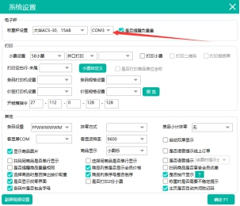 

图6-4云果OS系统设置

3. 本软件的条码生成设置需要与云果OS软件的条码设置一致。云果OS条码设置以及条码代表意思如图6-5所示，

本软件的条码生成设置，金额需设为两位小数点，重量需设为三位小数点。

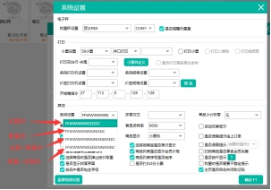 

图6-5云果OS条码设置

## 6.2超赢云POS

### 6.2.1传称流程

1. 进入超赢云POS软件界面（如图6-6所示），

2. 点击传称，进入传称界面，

3. 将电子秤型号改为“大华新版”，

4. 点击选择商品（如图6-7所示），

5. 选择商品类别，选择要下传的商品，点击确认，（不同的分类的商品无法一次性选择，需在确认后，再次重复第五步），

6. 点击下传，

7. 添加电子秤设置（如图6-8所示），填写“组号”、“型号”、“秤名”、“IP地址（查看IP地址方法请看附录A）”、“端口号”，点击下传即可。

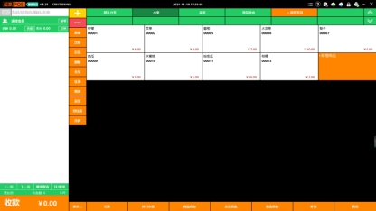 

图6-6超赢云POS界面

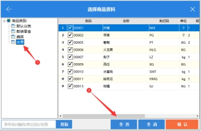 

图6-7选择商品

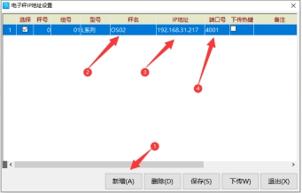 

图6-8电子秤设置

### 6.2.2注意事项

1. 传称的商品条码必须是五位数，商品的计价方式必须为称重，

2. 目前超赢云POS收银软件只能识别金额码，因此本软件的条码生成设置必须选择金额码，且金额的小数点位数设置为两位小数点，如图6-9所示。

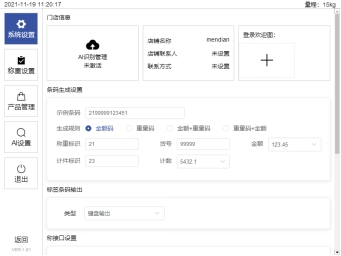 

图6-9条码生成设置

## 6.3科脉-赢钱云POS

### 6.3.1传称流程

1. 进入科脉-赢钱软件界面（如图6-10所示），

2. 点击设置，找到打印与外设（如图6-11所示），

3. 选择条码秤，

4. 填写“秤码格式”，“条码秤条码标识”（条码标识为00），“金额码进度”（一般为2），“重量码精度”（一般为3）（如图6-12所示），

5. 点击条码秤传称，

6. 填写“条码秤型”（选择大华TM15A协议），“条码秤地址”（查找IP地址方法请看附录A）（如图6-13所示），

7. 点击开始传秤即可。

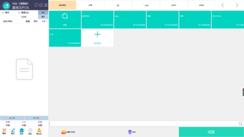 

图6-10科脉-赢钱云POS界面

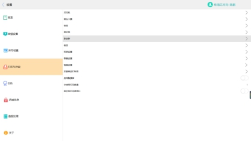 

图6-11打印与外设界面

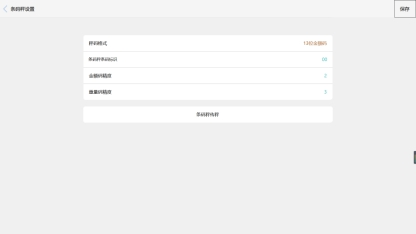 

图6-12条码秤设置

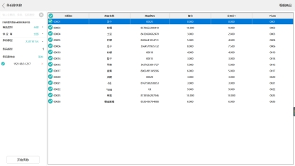 

图6-13条码秤传秤

### 6.3.2注意事项

1. 传称的商品“条码”,“商品名称”，“计价方式”（一定要选择称重），“生鲜码”，“PLU”五项缺一不可，没有生鲜码与PLU无法传秤，

2. 本软件的条码生成设置需要与科脉-赢钱云POS软件的条码格式一致。科脉-赢钱云POS条码设置如图6-14所示，目前本软件未设置有单价码，因此只有四种格式可以选择，

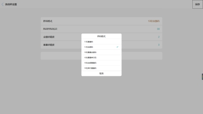 

图6-14科脉-赢钱云POS条码格式

## 6.4科脉-智赢+

### 6.4.1传称流程

1. 进入科脉-智赢+后台系统界面，选择营业系统（如图6-15所示）

2. 点击收银秤设置

3. 新增收银秤，填写“收银机型号”、“秤类型”、“IP地址”、“端口号”（如图6-16所示），勾选启用，点击保存即可，

4. 填写完收银秤信息回到营业系统，点击收银秤传输（如图6-17所示），点击下发档案即可。

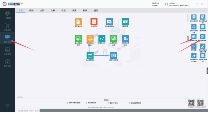 

图6-15科脉-智赢+后台界面

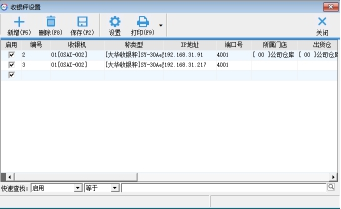 

图6-16收银秤设置

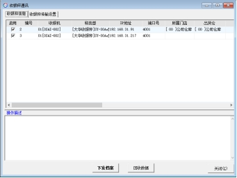 

图6-17收银秤传输

### 6.4.2注意事项

1. 传称的商品条码必须是五位数，计价方式要选择称重，

2. 本软件的条码生成设置需要与科脉-智赢+软件的秤码格式一致。科脉-智赢+条码设置如图6-18所示。条码秤条码标识填写00，条码金额精度选择2，重量码精度选择3，13位秤码格式可以选择“13位金额码”或者“13位重量码”，18位秤码格式可以选择“18位重量金额码”、“18位重量单价码”、“18位金额重量码”、“18位单价重量码”，目前本软件没有设置单价码，因此秤码格式只有四种可供选择，但所选的需与本软件的条码生成设置一致。在修改完成后点击保存，并确认本软件的条码生成设置是否与科脉-智赢+软件的秤码格式一致，

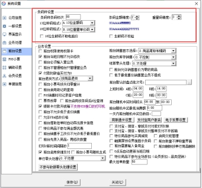 

图6-18科脉-智赢+条码设置

3. 由于科脉-智赢+软件不适用“字符串输出”，因此本软件的标签条码输出一定要选择“键盘输出”，如图6-19所示。

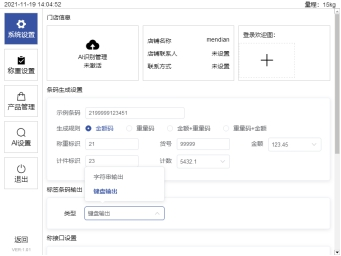 

图6-19键盘输出

## 6.5银豹

### 6.5.1传称流程

1. 进入银豹软件界面（如图6-20所示），

2. 点击全部菜单，进入系统设置（如图6-21所示），

3. 选择称重设备管理，选择条码秤设置（如图6-22所示），

4. 点击新增条码秤，填写条码秤信息（如图6-23所示），

5. 填写名称，品牌，型号，秤IP（查找IP地址方法请看附录A），端口，

6. 填写完成后，在右侧选择要下传的商品，并点击下载并配置条码秤，点击保存，

7. 点击保存后会跳转回称重设备管理界面，选择条码称格式（如图6-22所示），，

8. 选择对应的条码秤设备，点击下发传称即可。

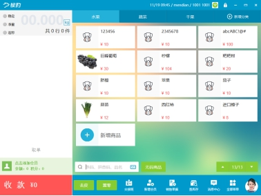 

图6-20银豹界面

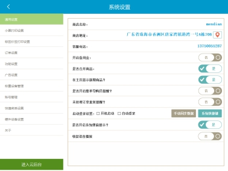 

图6-21系统设置

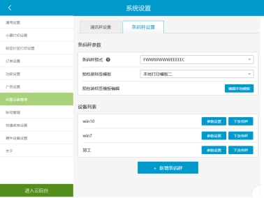 

图6-22条码秤设置

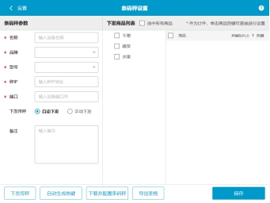 

图6-23新增条码秤

 

### 6.5.2注意事项

1. 传称的商品条码必须是七位数，且为称重商品，并打开传秤开关，秤编码为四位数（如图6-24所示），

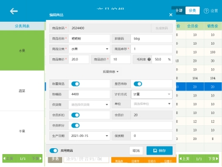 

图6-24商品信息

2. 本软件的条码生成设置需要与银豹软件下发传秤时的的条码设置一致。银豹条码设置如图6-25所示，代表意思如下：

F  -->  一个F代表两位数，称为部门或机位，银豹默认为21

五个W --> 商品编码

五个E --> 金额，例如999.99元

五个N --> 重量，例如99.999千克

C  --> 一位变量（用的最多），正校验码

O  --> 一位变量，反校验码

五个P --> 单价

D  --> 13位代号码

目前本软件仅有红框中的四种格式，与其他的格式目前未设置，在下传商品时需选择红框中的任一种并调整本软件的条码生成设置。

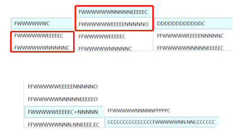

图6-25银豹条码设置