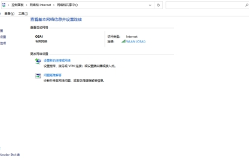
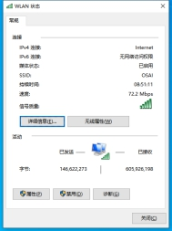
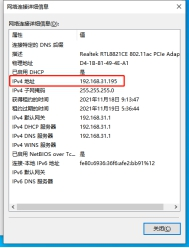

# 附录A

查找IP地址

1. 进入网络与Internet设置，

2. 进入网络和共享中心，如图A-1所示，

3. 点击连接的网络，若是WIFi连接即连接显示为WLAN，若是网线连接连接显示为本地连接，

4. 进入网络状态（如图 A-2所示），点击详细信息，

5. 详细信息中的ipv4地址即为秤的IP地址，如图A-3所示。

 

 

图A-1网络和共享中心

 

图A-2 WLAN状态

 

图A-3详细信息